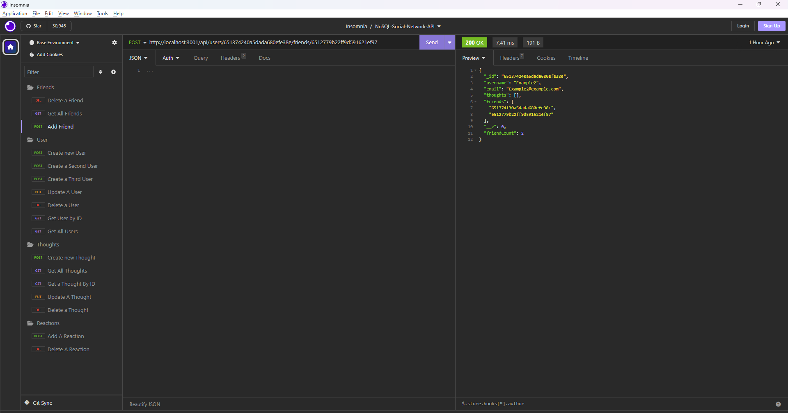
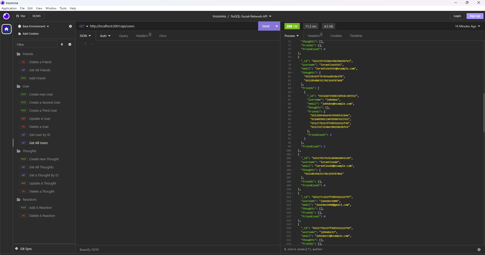
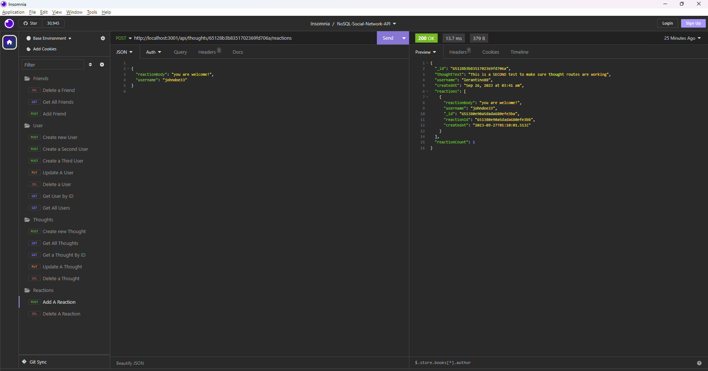

# NoSql : Social Network API

## Table of COntents

- [Description](#description)
- [Installation](#installation)
- [Insomnia Tests](#insomnia-tests)
- [Credits](#credits)
- [License](#license)

## Description

The NoSQL Social Network API is a backend application designed for testing routes for a social networking platform. It will enable users to interact with the platform by making friends, sharing thoughts, and reacting to friends' thoughts. This API is built using Node.js and Express.js for routing, MongoDB as the database, and Mongoose as the Object Data Modeling (ODM) library. It provides endpoints for various actions, including creating and updating users and thoughts, adding and removing friends, and managing reactions to thoughts. Mongoose and MongoDB are suitable for handling large amounts of unstructured data typically found in social networking applications.

## Installation

[Please Watch the walkthrough here](https://watch.screencastify.com/v/qdES5E871dowgNaoKo1R)

## Insomnia Tests

### Testing addFriend route

### Testing getAllUsers route

### Testing getAllThoughts route

### Testing createReaction route

## Credits

[MongoDB Documentation](https://www.mongodb.com/docs/manual/query-api/)

[Mongoose Documentation](https://www.npmjs.com/package/mongoose)

[Louis Delia & Marcos Mujica: Class Activities](https://git.bootcampcontent.com/George-Washington-University/GWU-VIRT-FSF-PT-05-2023-U-LOLC/-/tree/main/18-NoSQL/01-Activities)

[Day.js](https://day.js.org/docs/en/display/format)

## License

Copyright (c) 2023 hafsah1976

Permission is hereby granted, free of charge, to any person obtaining a copy
of this software and associated documentation files (the "Software"), to deal
in the Software without restriction, including without limitation the rights
to use, copy, modify, merge, publish, distribute, sublicense, and/or sell
copies of the Software, and to permit persons to whom the Software is
furnished to do so, subject to the following conditions:

The above copyright notice and this permission notice shall be included in all
copies or substantial portions of the Software.

THE SOFTWARE IS PROVIDED "AS IS", WITHOUT WARRANTY OF ANY KIND, EXPRESS OR
IMPLIED, INCLUDING BUT NOT LIMITED TO THE WARRANTIES OF MERCHANTABILITY,
FITNESS FOR A PARTICULAR PURPOSE AND NONINFRINGEMENT. IN NO EVENT SHALL THE
AUTHORS OR COPYRIGHT HOLDERS BE LIABLE FOR ANY CLAIM, DAMAGES OR OTHER
LIABILITY, WHETHER IN AN ACTION OF CONTRACT, TORT OR OTHERWISE, ARISING FROM,
OUT OF OR IN CONNECTION WITH THE SOFTWARE OR THE USE OR OTHER DEALINGS IN THE
SOFTWARE.
